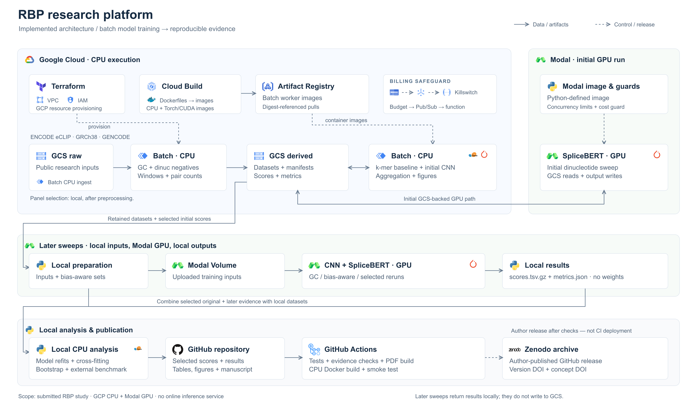

# Apparent sequence-model contribution depends strongly on negative-set construction

How much does an RNA sequence model add beyond nucleotide composition? Across 94 ENCODE eCLIP
datasets, the answer changes substantially with the construction of the negative examples. With
the model class, source peaks, chromosome-blocked fold design and estimator held fixed, the
primary 4-mer contribution spans **4.84-fold** (95% CI 3.98 to 5.81) across three negative-set
protocols. Stricter composition matching lowers apparent AUROC while increasing the estimated
contribution beyond composition.

Each protocol refits the model and composition baseline and retains the positives its matcher can
pair; the small resulting difference in retained positives is quantified below and does not
explain the result.

> **Practical implication:** Report a composition-only AUROC under the same negative-set protocol
> as the sequence-model AUROC, and do not compare incremental contributions across protocols.

**Paper:** [Preprints.org](https://doi.org/10.20944/preprints202609.0883.v1) (preprint; not yet peer
reviewed)

**Code and evidence:** [all versions](https://doi.org/10.5281/zenodo.22679284) ·
[v1.0.0 analysed snapshot](https://doi.org/10.5281/zenodo.22679285)

## Why I built this

I started somewhere else. I wanted to know whether a model that learns where an RNA-binding
protein sits could also flag disease variants, and for a while it looked like it could:
SpliceBERT separated pathogenic from benign non-coding variants at 0.83 AUROC, having never seen
a disease label.

Then I built the control. Evolutionary conservation alone, with no model at all, reached 0.91.
And scoring each variant with a **different** protein's model still reached 0.68, where chance is
0.50. The model was adding something real, but far less than it looked, and most of what looked
protein-specific was not. Those three numbers are in `results/tables/variant_ladder.csv`.

What kept getting in the way while I checked that was the negatives. Every AUROC I computed
rested on windows I had chosen to call "not bound", and I could not find a paper that reported
what a plain nucleotide counter scores on its own data. So I stopped chasing a better number and
measured the thing the number rests on. That is this paper.

## System architecture



The implemented pipeline used GCP Batch for CPU processing, GCS for the original data path,
Modal for GPU training, and local analysis to assemble the verified evidence. The later Modal
sweeps used uploaded volumes and returned scores locally rather than writing them back to GCS.

[Architecture details](docs/architecture.md) ·
[Editable SVG](docs/assets/rbp-architecture-overview.svg)

## Check it in thirty seconds, offline

No cloud account, no credentials and no external source-data download.

```bash
git clone https://github.com/NirmalKumar31/rbp-protocol-calibration.git
cd rbp-protocol-calibration
python -m pip install -e . -c constraints.txt      # enough to VERIFY, no torch

PYTHONPATH=src python scripts/verify.py --local results/tables   # 1156/1156
```

`verify.py` checks every published value against committed evidence and fails if any disagrees
with `config/golden.yaml`. Of the 1156 numeric assertions,
**1018 belong to this paper**, 136 to an earlier variant-scoring study whose code and evidence
are still here and still pass, and 2 are the harness checking itself. The verifier prints that
split on every run, because one total covering two papers is not this paper's evidence.

Two of its assertions are rebuilds rather than comparisons: **285 AUROCs recomputed from committed
per-window scores**, and the headline contrast recomputed **from raw sequence**.

```bash
python -m pip install -e '.[dev]' -c constraints.txt
PYTHONPATH=src python -m pytest tests -q \
  --ignore=tests/unit/test_models.py --ignore=tests/unit/test_train_folds.py

./scripts/preflight.sh        # everything CI runs. Prints PREFLIGHT PARTIAL without torch,
                              # and names what it could not run; it will not report CLEAN
                              # over a subset. Add '.[dev,neural]' for the full gate.
```

## What I found

| | |
|---|---|
| **The protocol moves the measurement** | Nested contribution for one 4-mer: **+0.0663** dinucleotide-matched, **+0.0265** GC-matched, **+0.0122** bias-aware. Apparent AUROC moves the *other* way, 0.798 to 0.688, in 94 of 94 datasets |
| **It holds for three model classes** | Spans of 5.42, 7.42 and 3.72 for a 4-mer, a 7089-parameter CNN and a fine-tuned SpliceBERT, on identical rows within each arm |
| **It is not an AUROC artefact** | The ordering survives five estimands including unbounded deviance. The magnitude does not: about 2.1-fold on unbounded scales |
| **The estimator has a floor** | Applied to a model whose information the baseline already contains, so the truth is zero, it returns **+0.0119 / +0.0137 / +0.0111** |
| **The floor is removable** | It is the outer-fold route, not conditioning. Cross-fitting cuts it by at least 95% and lands within 5e-4 of the known zero. The span goes 5.42 to **4.84** |
| **The baseline's order matters too** | At order three most of a 4-mer's contribution is gone. At order four the baseline overfits and the estimator's error exceeds most published increments |
| **It replicates on data I did not build** | On 135 held-out datasets from Horlacher et al. 2023, and the inverse relation **does not** replicate |
| **Nobody reports the baseline** | Of seven surveyed methods, five leave composition unconstrained and **none** reports a composition-only AUROC |

## The headline numbers, in full

The span is **4.84-fold** (95% CI 3.98 to 5.81) under the cross-fitted estimator this paper
recommends, and **5.42-fold** (4.43 to 6.58) under the two-stage estimator the literature actually
computes. Both are reported throughout and the cross-fitted one is primary, because the two-stage
one returns **+0.011 to +0.014** when the true contribution is zero by construction, which is
90.4% of the smallest arm's reported value. The neural spans are two-stage only, so they stay
exploratory; cross-fitting them would cost about $115.

Two things are **not** held fixed: model and baseline are refitted per protocol, and each matcher
rejects the positives it cannot pair, so the retained positives differ very slightly between arms.
Restricting to their intersection drops 0.23% of positives and moves the contrast +0.0398 to
+0.0401.

The nine train-by-evaluate combinations attribute most of the movement to the **evaluation**
protocol rather than the fitted model. Two decompositions, which are different estimands and not
two weightings of one: averaging each dataset's own normalised shares gives 63% (CI 57 to 68)
against 15% for training, and decomposing the matrix of panel means gives 81% (73 to 87) against
9%. Leave-one-protein-out moves the larger share by at most 3.0 points. It is descriptive, not
causal.

On 135 datasets from Horlacher et al. 2023 that the study panel does not contain, covering 108
proteins, the directional ratio between their two negative-set
constructions is **1.69** (95% CI 1.41 to 2.03) with the two-stage estimator
and **1.66** (1.40 to 1.98) with cross-fitting. Rebuilding their folds so
no chromosome is split gives 1.73 and 1.67, with cross-fold same-strand
neighbour leakage falling to zero. The benchmark is disjoint in datasets and processing, **not**
in proteins: 31 of 108 overlap, and excluding all shared proteins still gives 1.66. This was a
pre-specified analysis of a held-out subset of an already-known benchmark, not a prospective
search.

The panel is 95 datasets; 94 carry all three protocols, and the one that does not (NCBP2 in K562)
is named in Supplementary Table S1. Both counts are correct and appear throughout for different
quantities: `docs/PANELS.md` says which is which.

**What this repository does not establish.** Offline verification is regression checking against
committed evidence, not independent reproduction. The neural sweeps for two of three protocols are
committed rather than rebuilt by the default path, and anything needing the 2.9 GB window store
cannot be regenerated from a clone; `results/tables/PROVENANCE.csv` says which of the two every
released table is. Intervals condition on one negative draw and one fold partition.

## Two studies live here, and the larger files belong to the older one

The paper above is the current work. The same repository also carries the **superseded
variant-scoring study** described in "Why I built this", because the two share a pipeline:
`scripts/cloud_analysis.py` writes tables for both, so they cannot be split by directory without
editing a script that produces seven of this paper's tables.

It is kept rather than deleted, and named rather than left to be inferred:

| belongs to the older study | |
|---|---|
| `results/tables/variant_*` | 12 tables, and the three largest files in the repository are among them |
| `src/rbp/variants/`, `scripts/*variants*.py`, `cloud/modal/modal_variants.py` | its code |
| 136 of the 1156 assertions | the verifier prints the split on every run |

**Nothing in the paper depends on any of it.** `results/tables/unattributed/` holds two further
tables that no current script reproduces, and its own README says so.

## Rebuild it from raw data

The offline check above verifies released results rather than reconstructing them. Regenerating
the tables from raw data needs the window store and, for the neural arms, a GPU.

```bash
export GOOGLE_CLOUD_PROJECT=your-project
./run.sh preflight        # spends nothing, gates everything
./run.sh all              # pauses before every paid stage
```

`run.sh all` covers the dinucleotide arm end to end; the GC and bias-aware sweeps ran through
`cloud/modal/` and their per-window scores are committed rather than rebuilt. Full procedure and
per-stage detail: **[docs/REPRODUCE.md](docs/REPRODUCE.md)**.

Cost: **~$20 of real money** was spent on the published run, and **~$60** is the forecast for a
rerun without credits. One table, with measured separated from forecast:
**[docs/COST.md](docs/COST.md)**.
Every paid stage asks first.

## Layout

```
manuscript/     the paper and its figures
scripts/        one analysis per file; each writes a table under results/tables/
src/rbp/        the library the scripts import
tests/          899 tests, no network or cloud; 2 modules need torch
config/         params.yaml (the study's settings), golden.yaml (expected values)
results/tables/ every number in the paper (SCHEMA.md documents the columns)
data/evidence/  per-window out-of-fold scores for all three model classes
docs/           REPRODUCE, PANELS, COST, architecture, cloud-setup, operating
```

`PORTFOLIO.md` is a shorter reader's guide with three routes through the repository.

## Design rules

1. **Verification is a stage**, not an afterthought.
2. **No hardcoded project id.** Everything resolves through `rbp.utils.cloud`, and a test fails the
   build if a literal reappears. It watches a pattern, not one historical name, because it once
   watched only the old name and the new one duly reappeared underneath it.
3. **The panel is an artefact, not a flag.** Written once and committed three ways, so a reader
   never has to take it on trust.
4. **Task counts come from manifests**, never typed by hand.
5. **Completion markers are written last**, so an interrupted stage redoes its work rather than
   being skipped.

## Licence and citation

Code under MIT, derived data under CC BY 4.0. See `LICENSE` for the code and `NOTICE` for the
third-party sources the evidence derives from and the terms each carries. Intermediate window
tables containing genomic sequence are not redistributed and are regenerated from the ENCODE
accessions in Supplementary Table S1. Cite the study using the
[preprint DOI](https://doi.org/10.20944/preprints202609.0883.v1); cite the software or released
evidence using `CITATION.cff` and the relevant Zenodo DOI above.
