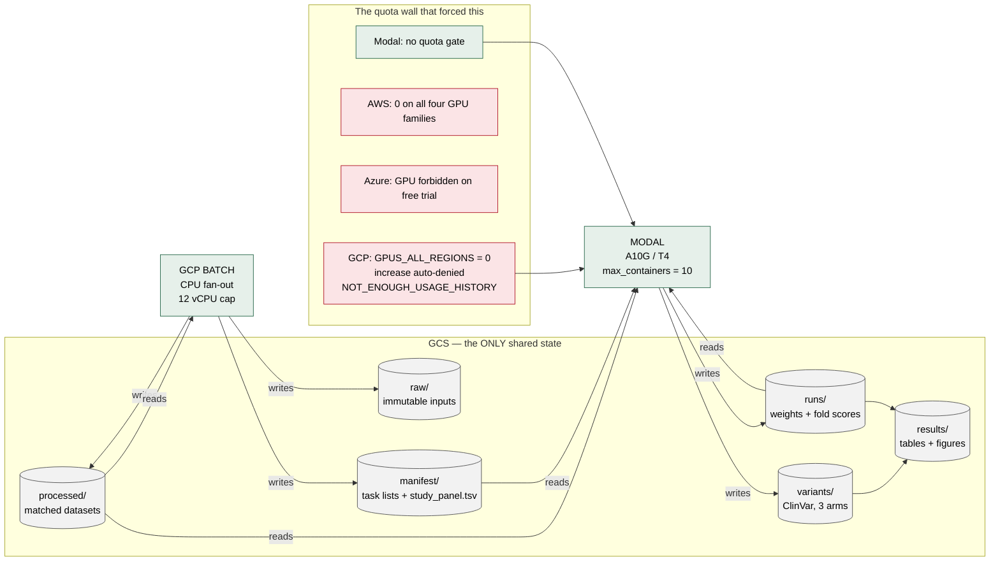
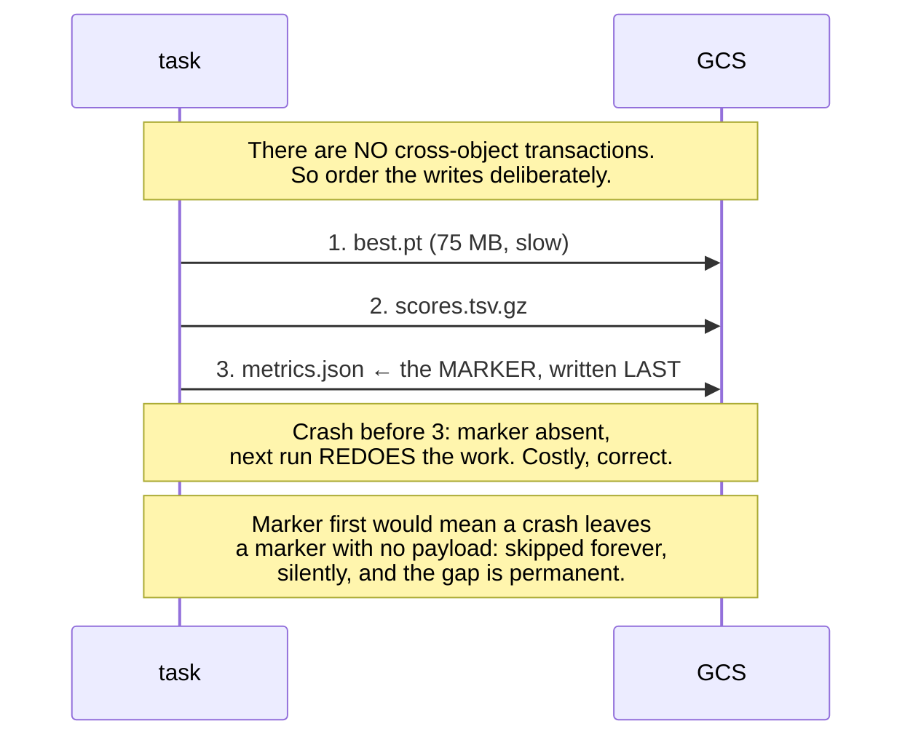
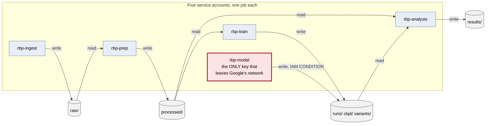
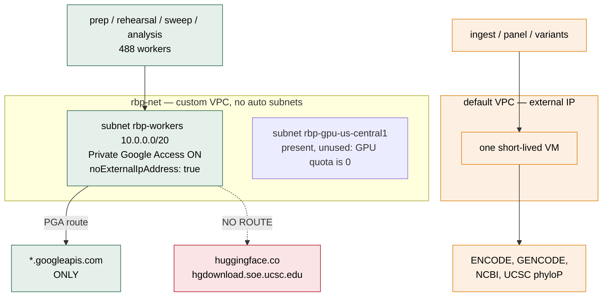
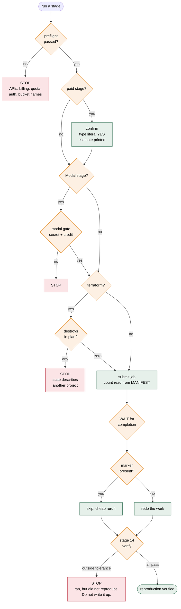
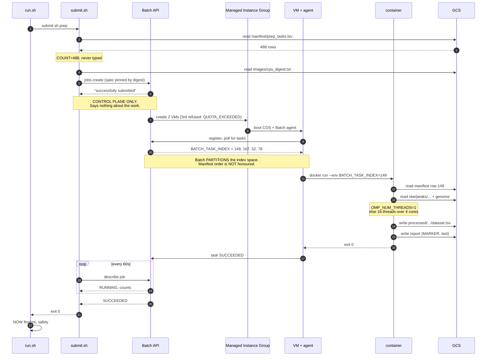

# 57. Architecture diagrams

Seven Mermaid diagrams. Render in GitHub, VS Code (Markdown Preview Mermaid Support), or
mermaid.live.

---

## 1. The pipeline: fifteen stages, and where each one runs

Colour = execution environment. Note that **stage 6 sits after stage 5**, which is the one
non-obvious edge in the whole graph.

```mermaid
flowchart TD
    subgraph LOCAL["LAPTOP — submits and reads, never computes"]
        S0["stage 0<br/>preflight<br/>$0"]
        S6["stage 6<br/>select panel<br/>$0"]
        S14["stage 14<br/>verify<br/>$0"]
    end

    subgraph GCPCTL["GCP control plane"]
        S1["stage 1<br/>terraform<br/>$0"]
        S2["stage 2<br/>build images<br/>~$0.50"]
    end

    subgraph BATCH["GCP BATCH — CPU fan-out, quota-capped at 8 concurrent"]
        S3["stage 3<br/>ingest<br/>PUBLIC IP"]
        S4["stage 4<br/>panel<br/>PUBLIC IP"]
        S5["stage 5<br/>prep 488 tasks<br/>~$2"]
        S7["stage 7<br/>rehearsal<br/>~$0.60"]
        S8["stage 8<br/>CNN sweep<br/>~$3"]
        S11["stage 11<br/>variants + phyloP<br/>PUBLIC IP"]
        S13["stage 13<br/>analysis<br/>~$0.10"]
    end

    subgraph MODAL["MODAL — GPU, no quota gate"]
        S9["stage 9<br/>SpliceBERT<br/>~$31 REAL MONEY"]
        S10["stage 10<br/>locality probe<br/>~$0.30"]
        S12["stage 12<br/>ClinVar x3 arms<br/>~$0.60"]
    end

    R1(["R1<br/>protocol effect"])
    R2(["R2<br/>four models"])
    R3(["R3<br/>locality"])
    R4(["R4<br/>variant ladder"])

    S0 --> S1 --> S2 --> S3 --> S4 --> S5 --> S6
    S6 --> S7 --> R1
    S6 --> S8 --> R2
    S6 --> S11
    S6 --> S9 --> R2
    S9 --> S10 --> R3
    S9 --> S12
    S11 --> S12 --> R4
    R1 --> S13
    R2 --> S13
    R3 --> S13
    R4 --> S13
    S13 --> S14

    classDef local fill:#e8eef7,stroke:#4878a8,color:#000
    classDef gcp fill:#e6f0ea,stroke:#2b6a4d,color:#000
    classDef modal fill:#fdf0e3,stroke:#e08214,color:#000
    classDef money fill:#fbe4e6,stroke:#b2182b,color:#000,stroke-width:3px
    classDef result fill:#f2f2f2,stroke:#555,color:#000

    class S0,S6,S14 local
    class S1,S2,S3,S4,S5,S7,S8,S11,S13 gcp
    class S10,S12 modal
    class S9 money
    class R1,R2,R3,R4 result
```



**Why stage 6 is after stage 5.** `pairs` — the number the panel is size-ranked on — counts the
positives that could *actually be matched* to a negative. Matching is a search, so `pairs` is a
**result** of preprocessing, not an input. A size-ranked panel cannot be chosen before prep has
produced the counts.

**The three-way fan-out** from stage 6 into stages 7, 8/9 and 11 is real parallelism: those
branches share no inputs and draw on **different quota pools** (GCP vCPU vs Modal containers).
`./run.sh parallel` exploits it.

---

## 2. The two-cloud split, and why



**What made the split cheap.** A training task's only cloud dependency is
`google-cloud-storage`. It reads its manifest and dataset from GCS, writes results back, and
takes its index from an environment variable. No Batch API calls, no metadata-server
assumptions. So `cloud_train.py` runs on Modal **unchanged**, and `aggregate` cannot tell
afterwards which platform produced a row.

---

## 3. Object layout, and the marker discipline

```mermaid
flowchart TD
    RAW[("BUCKET: PROJECT-raw<br/>immutable")]
    DER[("BUCKET: PROJECT-derived<br/>everything computed")]
    ART[("BUCKET: PROJECT-artifacts<br/>image digests")]
    TFS[("BUCKET: PROJECT-tfstate<br/>terraform state, versioned")]

    RAW --> R1["GRCh38.primary_assembly.genome.fa  3.1 GB"]
    RAW --> R2["gencode.v45.annotation.gtf.gz"]
    RAW --> R3["clinvar.vcf.gz"]
    RAW --> R4["peaks/K562/ + peaks/HepG2/  244 files"]
    RAW --> R5["config/panel_full.tsv  139 K562<br/>config/panel_full_HepG2.tsv  105"]

    DER --> D1["processed/{arm}/{cell}/{protein}/dataset.tsv"]
    DER --> D2["panel/{arm}/panel_final_{cell}_{arm}.tsv"]
    DER --> D3["manifest/prep_tasks.tsv<br/>manifest/rehearsal_tasks.tsv<br/>manifest/sweep_tasks{tag}.tsv<br/>manifest/study_panel.tsv  ← THE panel"]
    DER --> D4["runs/{arm}/{cell}/{protein}/{model}/fold{f}/<br/>best.pt + scores.tsv.gz + metrics.json"]
    DER --> D5["variants/tables/  windows, no FASTA needed<br/>variants/scores_sb/  matched head<br/>variants/scores_mm/  MISMATCHED head"]
    DER --> D6["results/tables/*.csv + results/figures/*"]

    ART --> A1["images/cpu_digest.txt<br/>images/gpu_digest.txt"]

    classDef bucket fill:#e8eef7,stroke:#4878a8,color:#000
    classDef key fill:#e6f0ea,stroke:#2b6a4d,color:#000
    class RAW,DER,ART,TFS bucket
    class D3,D4 key
```



**GCS has no directories.** `processed/dinuc/K562/QKI/dataset.tsv` is one flat object name
containing slashes. Consequence: a wrong path is indistinguishable from missing data, because
there is no schema to violate. Always list the parent prefix before concluding data is absent.

### The write order inside one task



---

## 4. Identity and blast radius



`rbp-modal`'s key sits in a Modal secret on a third-party platform, so its binding carries a
CEL condition:

```
resource.name.startsWith(".../objects/runs/")   ||
resource.name.startsWith(".../objects/ckpt/")   ||
resource.name.startsWith(".../objects/variants/")
```

Fully compromised, it cannot alter a dataset under `processed/`, cannot touch the raw bucket,
and cannot delete anything outside those three prefixes.

**This fired in practice.** The first Modal ClinVar probe scored its dataset correctly and then
took a 403 writing `variants/scores_sb/K562_AATF.csv` — because `variants/` was not yet in the
list. That is the guardrail working: a new write path stays denied until somebody widens it
deliberately, in Terraform.

---

## 5. Networking: deliberately not uniform



**Why no Cloud NAT.** It bills per gateway-hour *plus* per GB, which for occasional downloads
costs more than the downloads; it hands internet access to 488 workers that have no reason to
have it; and it makes every run depend on third-party sites being up.

**The consequence you must design around.** A sealed worker cannot
`from_pretrained("multimolecule/splicebert")` — that is why model weights are **baked into the
image**, so weights and code share one digest.

**The debugging signature.** A sealed worker attempting a non-Google host does not fail fast; it
**hangs** until `maxRunDuration`, because there is no route and the SYN goes nowhere. If a task
times out doing something that should be quick, suspect the network before the code.

---

## 6. The guards, and what each one catches



Every one of these exists because of a specific incident:

| guard | the incident |
|---|---|
| preflight | every failure of the first build was a free-to-detect environment problem found *after* spending |
| confirm + printed estimate | a 44%-too-high cost estimate reached $6 out of pocket before anyone compared it to the bill |
| Modal gate separate from GCP gate | the secret needs a service account that stage 1 creates: a single gate is unsatisfiable on a fresh project |
| **destroy guard** | a plan proposing **63 destroys** of the original study's buckets, with `-auto-approve` |
| count from manifest | `COUNT=189` against a 187-row manifest failed a job whose every real task succeeded |
| **wait for completion** | `finalize` would have run seconds after submit and written a **zero-dataset panel** |
| marker written last | a marker-first crash skips the task forever, silently |
| verify | a pipeline that completes and produces different science is worse than one that crashes |

---

## 7. One Batch task, end to end



**The two lines to remember.** Step 6, `"successfully submitted"`, is the control plane
accepting your JSON — nothing more. And step 12: because Batch partitions the index space, you
cannot express "run model X first" by ordering the manifest. Scope is expressed by *which*
manifest, which is why `MANIFEST_TAG` exists.
